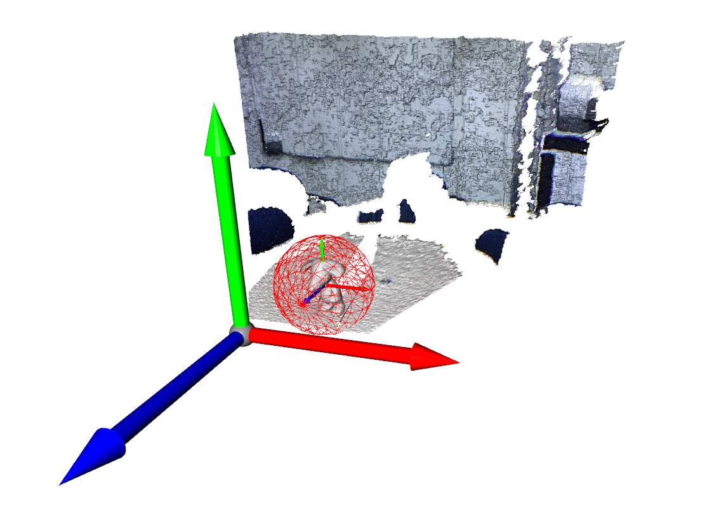
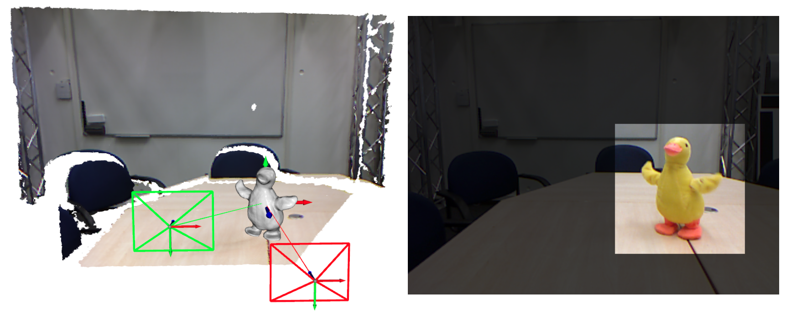
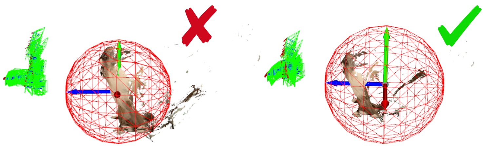

# Data preprocessing

This is a tutorial on how to preprocess your recorded RGB-D video.


### Step 1: Prepare dataset

The directory structure of your RGB-D sequence should be as follows:

```sh
  VIDEO
  └── rgb
  │		 ├── 0.jpg/png
  │		 ├── 1.jpg/png
  │		 ├── ...
  │		 └── ...
  ├──	depth	 
  │		 ├── 0.png
  │		 ├── 1.png
  │		 ├── ...
  │		 └── ...
  ├──	mask	 
  │		 ├── 0.png
  │		 ├── 1.png
  │		 ├── ...
  │		 └── ...
  └── intrinsics.txt
```

### Step 2: Convert coordinate system

#### 1. Registrating with Robust-ICP



Our method, following NDR, converts the coordinate system to be centered at target object using robust ICP:

```sh
cd pose_init

# Step1: Clone and compile Fast-Robust-ICP
git clone https://github.com/yaoyx689/Fast-Robust-ICP.git

# Compile
# Make sure Eigen is installed (sudo apt-get install libeigen3-dev)
# Check FRICP in path Fast-Robust-ICP/build/FRICP
mkdir build && cd build
cmake -DCMAKE_BUILD_TYPE=Release ..
make

# Step2: Registration
cd ..
python step1.py --depth_scale [depth_scale_] --data_path [data_path_] --registration_alg_path [FRICP_path_]

# Please follow instructions in NDR to Remove invalid points

# Step3: Obtain camera params
# Note: The larger object_scale is, the smaller the object would be
python step3.py --depth_scale [depth_scale_] --data_path [data_path_] --object_scale [object_scale_]

```

For more details & instructions of this part, please refer to [original repo](https://github.com/USTC3DV/NDR-code/tree/main/pose_initialization).

### 2. Create virtual cameras & views



This is a cool pipeline proposed by [JingwenWang95](https://github.com/JingwenWang95). It aims to simulate pseudo observations that fit the camera pose assumption of Zero-1-to-3. We provide a sequence, namely kfusion_snoopy, which has been preprocessed by the authors of NDR using Robust-ICP. Feel free to experiment with our preprocessing script:

```sh
python preprocess.py --config './configs/snoopy.yaml'
```


### 3. Additional tips



NOTE: Sometimes, the robust-ICP may fail (e.g. mochi). In that case, you may need to use SLAM poses and adjust the coordinate frame manually. We provide a script for visualization:

```sh
python visualizer.py --config './configs/snoopy.yaml'
```

You need to ensure: 1) The world coordinate is centered at the target object  2) The preprocessed rgb images contain the full target object. 3) The target object is within the scene bound (we use the unit sphere following NDR, but you can also change it if you want)

### Acknowledgement

This preprocessing pipeline has borrowed code from following repositories, many thanks to authors for sharing their code:

- [Fast-Robust-ICP](https://github.com/yaoyx689/Fast-Robust-ICP)
- [NDR](https://github.com/USTC3DV/NDR-code/tree/main/pose_initialization)

### Citations

If you find this preprocessing pipeline useful for your research, please consider citing all related papers:

```sh
@article{zhang2021fast,
  author={Juyong Zhang and Yuxin Yao and Bailin Deng},
  title={Fast and Robust Iterative Closest Point}, 
  journal={IEEE Transactions on Pattern Analysis and Machine Intelligence}, 
  year={2022},
  volume={44},
  number={7},
  pages={3450-3466}
}
  
@inproceedings{Cai2022NDR,
  author    = {Hongrui Cai and Wanquan Feng and Xuetao Feng and Yan Wang and Juyong Zhang},
  title     = {Neural Surface Reconstruction of Dynamic Scenes with Monocular RGB-D Camera},
  booktitle = {Thirty-sixth Conference on Neural Information Processing Systems (NeurIPS)},
  year      = {2022}
}

@article{wang2023morpheus,
        title={MorpheuS: Neural Dynamic 360 $\{$$\backslash$deg$\}$ Surface Reconstruction from Monocular RGB-D Video},
        author={Wang, Hengyi and Wang, Jingwen and Agapito, Lourdes},
        journal={arXiv preprint arXiv:2312.00778},
        year={2023}
}
```

